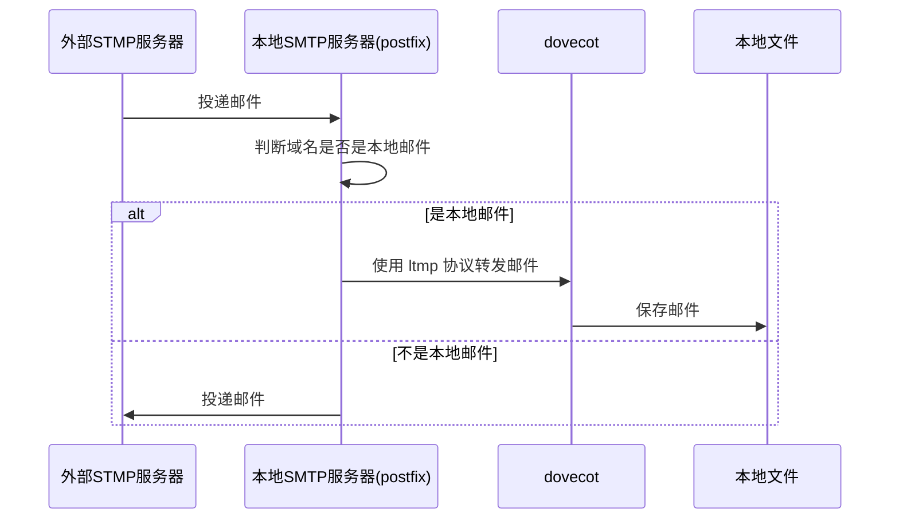

# 关于邮件系统的搭建

## 使用说明

需要在建立 `./ssl` 和 `keys/` 两个目录,用于保存所需的证书和邮件签名用的公私钥。也可以在`docker-compose.yml`中修改映射目录.另外现在注释了 docker 系统的国内镜像,如果在国内使用需要修改 dockefile.

!!! 需要注意的是,由于 postfix 依赖于另外的几个服务，所以它应该是最后启动,虽然在`docker-compose`中配置了相关的依赖,但有时候还是需要等其它服务启动后再手动重启一下 postfix.

```sh
# 在单机中启动系统
docker compose up --build
```

## 系统的说明

postfix 是 SMTP 服务器, dovecot 是邮箱服务器, 其工作流程是：



postfix 只会验证是否存在该用户以及如何保存。当 STMP 需要验证密码时,则需要通过 SASL 或 dovecot 去验证密码.

### postfix

SMTP 协议服务器,用于邮件的投递. 外部邮件如 126, 163 等也是先将邮件投递到 postfix 再由 postfix 转发给 dovecot.

### dovecot

POP3, IMAP 服务器,用于管理用户信箱服务器, dovecot 本身不负责邮件的投递,仅管理用户的信箱.用户的信箱最终还是保存在磁盘文件,由于存储存空间限制也可以使用分布式存储保存邮件[将邮件保到 AWS S3](https://doc.dovecot.org/2.3/configuration_manual/mail_location/obox/s3/),但这个好像是付费插件. 还有一种办法是使用 [S3QL](https://github.com/s3ql/s3ql) 或 [s3fs-fuse](https://github.com/s3fs-fuse/s3fs-fuse)，将对象存储挂载成文件系统.

### CyrusSASL

SASL 协议(简单认证和安全层), 而 CyrusSASL 是 SASL 协议的一个实现,可以与 ftp, postfix 等服务提供用户验证功能.

postfix 自身提供两种认证方式，可以使用 `postconf -a` 查看.本次配置中使用的 dovecot 验证, 但如果没有 dovecot 服务，需要使用 LDAP 或本地文件保存用户/密码等则需要 saslauth 协助验证.

CyrusSASL 提供一个 unix 管道,与 postfix 建立通信.

### mysql

本例中使用 mysql 作为虚拟邮件数据库,用户邮箱地址、密码、域名等均保存在数据库. 但邮件是保存在磁盘文件中。

## 关于域名

邮件服务需要的域名解析有点多包括正向和反向的解析，DNS 配置是否正确可以使用[dmarcly 工具](https://dmarcly.com/tools/)验证配置是否生效.

1. A 记录,指向 postfix 和 dovecot 服务器,如果分开则需要多条记录。
2. MX 记录,告诉发送邮件的服务器应该将邮件发送到哪个邮件服务器。

以上两个是邮件服务必须的两个域名解析.

```sh
mail	A	  104.224.181.92
@	    MX	mail.viweei.me
```

3. PTR 记录, 是由 IP 反向解析域名的记录,用对邮件接收方确认根据 IP 确认域名。**这项设置不在域名服务商,而是在主机服务商设置**。

这里需要注意一下 [搬瓦工](https://bandwagonhost.com/),反向解析是不收费的,进入到主机面板即可设置.但腾讯云是要收费的 300 元/1 条/年。

4. SPF 记录,由域名所有者在其 DNS 记录中发布的，用于指定哪些邮件服务器被授权代表该域名发送电子邮件.

举个例子，当 postfix 将邮件投递给 google 的 SMTP 服务器, 只能得到一个 IP 地址. 该 IP 能否代表该邮件发送邮件？所以 google 会通过 SPF 记录去验证发件 IP 是否合法。

设置 SPF 需要添加一条 **TXT** 记录

```sh
@     TXT	v=spf1 ip4:203.0.113.1 -all

# 在这个示例中：
# v=spf1：          指定 SPF 记录的版本。
# ip4:203.0.113.1： 授权 IP 地址 203.0.113.1 发送该域名的电子邮件。
# -all：            表示除上述授权的服务器外，所有其他服务器都不被授权发送该域名的电子邮件。

# 拒绝所有，表示这个域名不会发出邮件
v=spf1 -all

# 通过所有，域名所有者认为 SPF 没用，根本不鸟它。
v=spf1 +all

# 允许当前域名的 MX 记录对应的 IP 地址
v=spf1 mx -all

# 允许当前域名和 mail.example.com 的 MX 记录对应的 IP 地址
v=spf1 mx mx:mail.example.com -all
```

SPF 记录是由域名所有者发布的，用于指定哪些邮件服务器被授权发送该域名的电子邮件。接收邮件服务器会查询并使用这些记录来验证发件人的合法性，从而防止未经授权的邮件服务器冒充该域名发送电子邮件。

**验证 SPF 是否生效**

```sh
dig TXT viweei.me
```

5. DKIM 记录, 通过指定一系列策略和报告选项，帮助域名所有者防止邮件欺骗，并提供详细的报告以便监控和改进邮件安全。说白了就是对方检测出有人冒充你发邮件，给你一个报告回馈。

**验证 DIMK 是否生效**

```sh
dig TXT default._domainkey.viweei.me
```

6. DMARC 记录, 是当 SPF, DKIM 检测。

```sh
v=DMARC1;
# p 告知邮件接收方，当检测到某封邮件在伪造邮件发送方，邮件接收方要做出什么样的处理。处理的方式有：
# none：不做任何处理
# quarantine：将邮件标记为垃圾邮件
# reject：拒绝该邮件
p=quarantine;
# rua 邮件接收方检测一段时间后，将这段时间内的统计报告，发送到哪个邮箱地址。
rua=mailto:test@viweei.me;
# ruf 邮件接收方检测到伪造邮件时，将该伪造信息的报告发送到那个邮箱。
ruf=mailto:test@viweei.me;

# fo 选项指定在生成失败报告时的选项。
# 0：只在 SPF 或 DKIM 失败时生成报告（默认）。
# 1：在 SPF 或 DKIM 失败时生成报告。
# d：在 DKIM 失败时生成报告。
# s：在 SPF 失败时生成报告。
fo=0;

# adkim 选项指定 DKIM 对齐模式。
# r（relaxed）：宽松模式，子域名也被认为是对齐的。
# s（strict）：严格模式，只有完全匹配的域名才被认为是对齐的。
adkim=r;

# aspf 选项指定 SPF 对齐模式
# r（relaxed）：宽松模式，子域名也被认为是对齐的。
# s（strict）：严格模式，只有完全匹配的域名才被认为是对齐的。
aspf=r;
# pct 选项指定策略适用的邮件百分比
pct=100;
# rf 选项指定报告格式,使用 Authentication Failure Reporting Format（AFRF）格式生成报告
rf=afrf;
# ri 选项指定生成报告的间隔时间（以秒为单位）
ri=86400;
# sp 选项指定子域名的策略
# none：不采取任何措施。
# quarantine：将邮件标记为可疑。
# reject：拒绝邮件。
sp=quarantine
```

假设 DNS 记录是这样的：

| Type | Host                | Answer                                    |
| ---- | ------------------- | ----------------------------------------- |
| TXT  | \_dmarc.m31271n.com | v=DMARC1; p=reject; rua=m31271n@viweei.me |

这样的配置的意义是：拒绝伪造邮件，并将一段时间内汇总报告发送给到 m31271n@viweei.me.

**验证 DMARC 是否生效**

```sh
dig TXT _dmarc.viweei.me
```

## 邮件测试

1. 垃圾邮件评测 [smtpserver](https://smtpserver.com/cn/mail-tester), [mail tester](https://www.mail-tester.com/),这个一在只能测试 3 次.

## 后续工作

1. 邮件过滤
   Amavis spamassasin(垃圾邮件), clamav(病毒查杀)

2. 防止暴力破解 fail2ban
